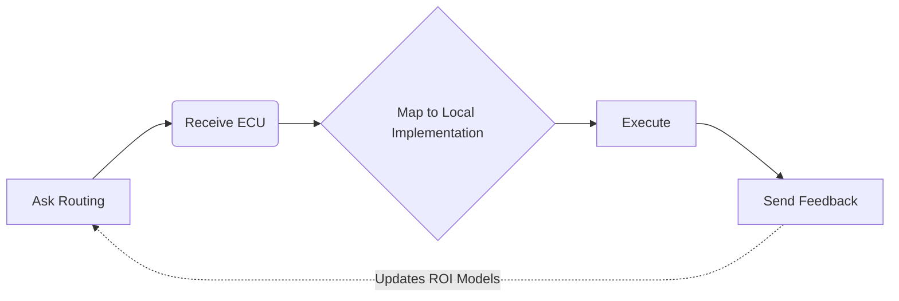

<div align="center">


# WisePick | 智选

**The Deterministic Scaffold for Agentic Capability Routing | 面向 Agent 能力路由的确定性脚手架**

[](https://github.com/w2jmoe/WisePick/stargazers)
[](./LICENSE)
[](https://twitter.com/w2jmoe)


</div>

---

**🚀 WisePick Decision API (WPDA) v0.2.0**

* WisePick does not recommend apps to humans. It routes executable capabilities to agents at 0.0s latency.
* 智选不向人类推荐应用；它为 Agent 提供 0.0s 延迟的确定性决策路由。
> 
*  **Help us refine:** If you find the docs confusing, please [open an issue](https://github.com/w2jmoe/WisePick/issues)—we are aggressively refining our integration flow.
*  **反馈建议：** 若您在接入中遇到任何困惑，请 [提交 Issue](https://github.com/w2jmoe/WisePick/issues)，我们正在全力优化文档与接入体验。

---

## 📘 Contents | 目录

- [🚀 Quick Start](#-quick-start--快速启动) 　　　　　　　　 |　　　快速启动
- [⚡ Why Integrate WisePick](#-why-integrate-wisepick--为什么接入智选) 　 　 |　　　为什么接入智选
- [📜 Performance Benchmarks](#-performance--cost-benchmarks--性能与成本报告)　　|　　　性能与成本报告
- [🔌 Integration Specification](#-integration--router-specification--集成与路由规范) 　 　 |　　　集成与路由规范
- [🧠 How It Works](#-how-it-works--工作原理) 　　　　　　　 |　　　工作原理
- [🏗️ Architectural Paradigm](#%EF%B8%8F-architectural-paradigm--架构范式演进) 　　　 |　　　架构范式演进
- [🧪 Agent Workflow](#-agent-workflow--agent-工作流) 　 　　　　　|　　　Agent 工作流
- [🗺️ Roadmap](#%EF%B8%8F-roadmap--路线图) 　　　　　　　　　|　　　路线图

---

## 🛡️ Decision Infrastructure | 决策基础设施

> **Arch Positioning:** WisePick is independent of the tool discovery layer. Whether your agent uses static hard-coding, dynamic marketplaces, or MCP, WisePick operates purely as the unified ECU decision plane—accepting natural intent and outputting the optimal execution path.

> **架构定位:** 智选完全独立于工具发现层。无论 Agent 是通过静态硬编码、动态插件市场还是 MCP 协议发现能力，智选均作为统一的 ECU 决策面，负责输入意图并输出最优执行路径。

```text
Executable Capability Unit (ECU)
A standardized executable capability an agent can route, invoke, and learn from.
可执行能力单元（ECU）：可被路由、调用并通过反馈学习的标准化能力抽象。

```

---

## ❓ What Problem It Solves | 解决什么问题

Most agents fail from poor capability routing, not weak models.

多数失败来自能力路由失准，而非模型能力不足。

* Blind capability search · 盲目遍历能力
* Trial-and-error execution · 反复试错执行
* No execution feedback loop · 缺少反馈闭环

WisePick replaces guessing with learned routing.

智选用数据驱动的能力路由替代猜测。

---

## 🚀 Quick Start | 快速启动

> **⚠️ Production Deployment Requirement:** WisePick API is **core infrastructure** for your production product and must be deployed independently in your production environment. Local testing is for logic validation only. When you ship, include the WisePick API Server in your production containerized deployment manifest. Agents without an online API revert to inefficient stochastic routing and lose determinism.
>
> **⚠️ 生产部署要求：** WisePick API 是您生产产品的**核心基础设施**，必须在生产环境中独立部署。本地测试仅用于验证逻辑；发布产品时，请务必将 WisePick API Server 纳入您的生产容器化部署清单。未部署在线 API 的 Agent 将回退至低效随机路由，失去确定性。

### 1. Server (部署决策服务)
Deploy the WisePick API locally. 
部署本地智选 API 服务。

```bash
# 1. Clone & Config
git clone https://github.com/w2jmoe/WisePick.git
cd WisePick
cp .env.example .env
# Configure DATABASE_URL in .env

# 2. Start Service
pip install -r requirements.txt
uvicorn app.main:app --reload --host 0.0.0.0 --port 8000

```

### 2. Integration (接入 SDK)

> Check out the [15-Minute Developer Integration Guide](./README_API.md#15-minute-integration-checklist) for rapid SDK setup, `tool_choice` hard-injection, and full-loop feedback implementation.

> 查看 [15分钟开发者接入指南](./README_API.md#15-minute-integration-checklist)，获取 SDK 快速接入、`tool_choice` 硬强制注入与反馈闭环全链路实现方案。 

---

## ⚡ Why Integrate WisePick | 为什么接入智选

* Lower cost and latency by cutting trial-and-error.
更低成本与延迟：减少无效试错与 Token 浪费。
* Deterministic selection: one best ECU per decision.
确定性输出：每次决策对应单一最优 ECU。
* Self-evolving loop: routing improves from execution feedback.
自进化闭环：执行反馈持续修正路由统计。

---

## 📜 Performance & Cost Benchmarks | 性能与成本报告

Production-oriented deterministic routing vs. native LLM tool-calling. Tested inside a Hermes-style agent runtime.
面向生产的确定性路由与原生 LLM 工具调用的对比测试。已在 Hermes 类 Agent 运行时中完成验证。

### Runtime Efficiency | 运行时效率提升

| Metrics | Native LLM | WisePick | Optimization |
| --- | --- | --- | --- |
| **🚀 Path Speed** | Baseline | **~31% Faster** | Shrunk from 6.33 to 4.33 steps |
| **⏱️ Time Saved** | Baseline | **~62% Saved** | Benchmark cut from 12m to 4m30s |
| **💵 Cost Cut** | High | **~33% Reduced** | $0.15 → $0.10 per session |
| **🎯 First-Hit Rate** | Exp. | **100% Locked** | Zero hallucinated tool-selection |

### Key Capabilities | 核心优势

* **Zero-Latency Gatekeeping**: Sub-millisecond average latency under isolated routing-core stress testing. (隔离路由核心压测下平均亚毫秒级延迟)
* **Anti-Loop Depth**: Stabilizes execution across 20+ mixed-tool tasks without infinite loops. (在 20+ 混合工具任务下稳定运行，彻底消除无限循环路径)

Benchmark scripts & instrumentation: [BENCHMARK](./benchmark/) | [STRESS_TEST_RESULTS.md](./docs/STRESS_TEST_RESULTS.md)

---

## 🔌 Integration & Router Specification | 集成与路由规范

WisePick acts as a stateless decision layer. You own the execution; we provide the routing.

无状态决策层：仅负责意图路由，不保存执行状态。

* **For Human Builders / 面向人类开发者 ([README_API.md](./README_API.md)):**
SDK integration, programmatic turn interception, multi-turn lock release, and execution hook feedback closure.
SDK 代码集成、首轮意图拦截、多轮强制解锁以及执行钩子反馈闭环。
* **For AI Agents & Automation / 面向智能体与自动配置 ([AGENTS.md](./AGENTS.md)):**
Machine-readable `wisepick.agent.v1` manifest contract, protocol state machine mapping, and runtime environment declaration.
机器可读的声明式配置清单契约、协议状态机映射以及运行时环境依赖声明。
* **Aetheris (Experimental) / 持久化运行时适配 ([adapter.py](./adapters/aetheris_adapter.py)):**
Durable AI Agent Runtime integration. WisePick acts as the deterministic RoutingAdvisor by emitting audit-ready decision_id, score, and reason_codes. This allows runtimes to replay execution paths without re-invoking the router.

---

## 🧠 How It Works | 工作原理

### Capability Matching | 能力匹配

Task text → capability labels derived from bootstrap rules.

任务文本 → 由引导规则得到能力标签。

```text
task → capabilities

```

### Capability Scoring | 能力评分

```text
score =
capability_match       * 0.40  (语义匹配度 - 核心逻辑)
execution_success_rate * 0.20  (历史可靠性)
efficiency_factor      * 0.20  (执行效率 - 基于 avg_latency_ms)
economy_factor         * 0.10  (成本性价比 - 基于 avg_token_cost)
bootstrap_weight       * 0.10  (初始冷启动权重)

*Note: Latency and Cost are normalized against the current capability cohort.*
*注：延迟（Latency）和成本（Cost）数据均已针对当前候选能力组进行了归一化处理。*

```

### Feedback Loop | 反馈闭环

```text
decision → execution → feedback → capability_stats → next decision

Routing updates from real execution outcomes.
路由统计随真实执行结果更新。

```

### Components | 核心组件

```text
Routing Core (decision_engine)
将输入任务转换为 ECU（执行单元）评分并进行路由决策。

Capability Registry (api_tool_specs)
管理可用 Provider、能力标签及冷启动权重分配。

Execution Memory (tool_stats, feedback)
存储执行成功率与反馈结果，支持闭环优化。
```

### Optional YantrikDB | 可选 YantrikDB

*Enterprise cluster awareness · 企业级集群感知*

Optional integration via `YANTRIK_DB_URL` (and optional `YANTRIK_DB_API_KEY`): reads YantrikDB `/v1/health`, may scale ECU scores under high replication lag—no primary schema change.

可选接入：读取 YantrikDB `/v1/health`，复制滞后过高时可缩放 ECU 分数；**不修改**主库 Schema。

### Optional Langfuse Telemetry | 可选 Langfuse 遥测

*Decoupled observability · 解耦可观测性*

Optional integration via `WISEPICK_LANGFUSE_PUBLIC_KEY` and `SECRET_KEY`: exports `mcp.route_decision.v1` telemetry via background thread—no impact on request latency.

可选接入：通过后台线程导出 `mcp.route_decision.v1` 遥测数据；**不影响**请求延迟。

---

## 🏗️ Architectural Paradigm | 架构范式演进

WisePick unifies both hard-coded and dynamic tool discovery under a deterministic routing layer.
智选将硬编码与动态发现路线统一于确定性路由层，解决向动态模式（如 MCP）转型中的工具焦虑。

| Paradigm | Discovery| Runtime Pain | WisePick Value |
| --- | --- | --- | --- |
| **Static** | Manual config | Brittle scaling, zero runtime flexibility | Centralized ECU registry, cleaner code |
| **Dynamic** | Auto-discovery | **Tool Anxiety:** Context explosion, loops, hallucinations | **Deterministic Filter:** Cuts 95% noise, 100% lock |

## 🔬 ECU Response (with ROI Metrics) | 带有 ROI 指标的 ECU 响应

```json
{
  "metadata": {
    "schema_version": "mcp.route_decision.v1",
    "decision_id": "dec_abc123def4567890",
    "trace_id": "trace_9876543210abcdef",
    "router_name": "wisepick",
    "capability_id": "audio_transcription",
    "provider": "feishu_minutes",
    "execution_type": "api",
    "callable": true,
    "confidence": 0.87,
    "latency_ms": 450,
    "candidate_count": 1,
    "top_candidates": [
      {
        "rank": 1,
        "capability_id": "audio_transcription",
        "score": 0.87,
        "selected": true
      }
    ],
    "reason_codes": ["capability_match"]
  },
  "output": {
    "capability_id": "audio_transcription",
    "callable": true
  }
}

```

WisePick predicts performance before execution to ensure the best ROI.

WisePick 在执行前预测性能，以确保最佳投资回报率 (ROI)。

## 🧪 Agent Workflow | Agent 工作流



WisePick provides decision intelligence and feedback loops—not task execution.

智选提供决策智能与反馈闭环；**不替代**任务执行本身。

---

## 🔮 Vision | 愿景

**Today:** Local execution learning.

**Tomorrow:** Shared decision memory.

**当下：** 本地执行反馈驱动学习。

**下一步：** 共享决策记忆。

Execution outcomes become portable capability experience—not repeated trial and error.

执行结果沉淀为可迁移的能力经验，而非重复试错。

---

## 🗺️ Roadmap | 路线图
 
* **✅v0.1**: Core Infrastructure · 核心路由与反馈闭环
  - Deterministic ECU routing & feedback loop.
  - Multi-dimensional ROI metrics aggregation (Latency / Cost / Quality).

* **🔄v0.2**: Runtime-Aware Optimization · Runtime 感知执行优化
  - Task-level capability routing for multi-agent runtimes.
  - Adaptive execution-path optimization based on latency / cost / quality feedback.
  - Lightweight integration adapters for orchestration frameworks.

* **🔄v0.3**: Collective Decision Memory · 集体决策记忆
  - Cross-agent experience sharing.
  - Global capability indexing & optimization.

---

## 🤗 Feedback & Integration | 反馈与集成

Share use cases, routing results, or failure reports.

欢迎反馈接入场景、路由结果或失败案例。

* **Issues:** [GitHub Issues](https://github.com/w2jmoe/WisePick/issues)
* **Email:** w2jmoe@gmail.com

**Every routing decision is observable, feedback-driven, and reproducible.** **每一次路由决策可观测、可反馈、可复现。**

**Every decision sharpens the path to perfect agency.** **每一次决策，都在打磨通往完美能动性的路径。˗ˋˏ( ´͈ ᗜ `͈ )ˎˊ˗**

---

## 🌸 License | 许可协议

Apache License 2.0 — see [LICENSE](./LICENSE).


