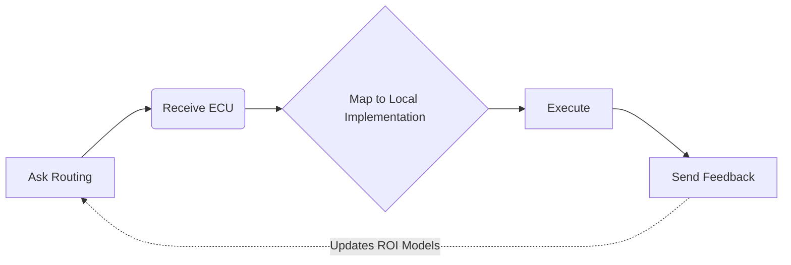

<div align="center">


# WisePick | 智选

> **Docs:** [Overview](./README.md) | [Integration & SDK](./README_API.md) | [Agent Protocol](./AGENTS.md)

**The Deterministic Scaffold for Agentic Capability Routing | 面向 Agent 能力路由的确定性脚手架**

[](https://github.com/w2jmoe/WisePick/stargazers)
[](./LICENSE)
[](https://twitter.com/w2jmoe)


</div>

---

## 🚀 WisePick Decision API (WPDA)

* Deterministic capability routing for AI agents.
* 为 AI Agent 提供确定性能力路由。

### What it is / 智选是什么

A deterministic decision layer for agent runtimes — independent of tool discovery, runtime silos, or framework lock-in.

面向 Agent Runtime 的确定性决策层 — 独立于工具发现、运行时孤岛和框架锁定。

### Why it matters / 为什么重要

WisePick turns execution outcomes into reusable ECU feedback, so agents can choose better capabilities faster.

智选将执行结果沉淀为可复用的 ECU 反馈，让 Agent 更快选对能力。

> ECU (Executable Capability Unit)
> 
> A standardized executable capability an agent can route, invoke, and learn from.
> 可执行能力单元：可被路由、调用并通过反馈学习的标准化能力抽象。

## 🌐 Ecosystem Alignment | 生态兼容

[](https://github.com/yantrikos/yantrikdb-server)
[](https://github.com/avivsinai/langfuse-mcp)
[](https://github.com/dgenio/ChainWeaver)
[](https://github.com/Colin4k1024/Aetheris)
[](https://github.com/azender1/SafeAgent)

---

## 📘 Contents | 目录

- [🚀 Quick Start](#-quick-start--快速启动) 　　　　　　　　 |　　　快速启动
- [⚡ Why Integrate WisePick](#-why-integrate-wisepick--为什么接入智选) 　 　 |　　　为什么接入智选
- [📜 Performance Benchmarks](#-performance--cost-benchmarks--性能与成本报告)　　|　　　性能与成本报告
- [🔌 Integration Specification](#-integration--router-specification--集成与路由规范) 　 　 |　　　集成与路由规范
- [🧠 How It Works](#-how-it-works--工作原理) 　　　　　　　 |　　　工作原理
- [🏗️ Architectural Paradigm](#%EF%B8%8F-architectural-paradigm--架构范式演进) 　　　 |　　　架构范式演进
- [🧪 Agent Workflow](#-agent-workflow--agent-工作流) 　 　　　　　|　　　Agent 工作流
- [🗺️ Roadmap](#%EF%B8%8F-roadmap--路线图) 　　　　　　　　　|　　　路线图

---

## 🚀 Quick Start | 快速启动

> WisePick is production infrastructure for agent runtimes.
> Deploy it as an independent API service.
>
> 智选是 Agent Runtime 的生产级决策基础设施。
> 请将其作为独立 API 服务部署。

### 1. Start Server | 启动服务

```bash
git clone [https://github.com/w2jmoe/WisePick.git](https://github.com/w2jmoe/WisePick.git)
cd WisePick

cp .env.example .env
# Configure DATABASE_URL

pip install -r requirements.txt

uvicorn app.main:app --reload --host 0.0.0.0 --port 8000

```

### 2. Integrate SDK | 接入 SDK

See the [15-Minute Integration Guide](./README_API.md%2315-minute-integration-checklist).

查看 [15分钟接入指南](./README_API.md%2315-minute-integration-checklist)。

**Help us refine:** If you find the docs confusing, please [open an issue](https://github.com/w2jmoe/WisePick/issues) — we are aggressively refining our integration flow.
**反馈建议：** 若您在接入中遇到任何困惑，请 [提交 Issue](https://github.com/w2jmoe/WisePick/issues)，我们正在全力优化文档与接入体验。

---

## ⚡ Why Integrate WisePick | 为什么接入智选

* Lower cost and latency by cutting trial-and-error.
更低成本与延迟：减少无效试错与 Token 浪费。
* Deterministic selection: one best ECU per decision.
确定性输出：每次决策对应单一最优 ECU。
* Self-evolving loop: routing improves from execution feedback.
自进化闭环：执行反馈持续修正路由统计。

---

## 📜 Performance & Cost Benchmarks | 性能与成本报告

Production-oriented deterministic routing vs. native LLM tool-calling. Tested inside a Hermes-style agent runtime.
面向生产的确定性路由与原生 LLM 工具调用的对比测试。已在 Hermes 类 Agent 运行时中完成验证。

### Runtime Efficiency | 运行时效率提升

| Metrics | Native LLM | WisePick | Optimization |
| --- | --- | --- | --- |
| **🚀 Path Speed** | Baseline | **~31% Faster** | Shrunk from 6.33 to 4.33 steps |
| **⏱️ Time Saved** | Baseline | **~62% Saved** | Benchmark cut from 12m to 4m30s |
| **💵 Cost Cut** | High | **~33% Reduced** | $0.15 → $0.10 per session |
| **🎯 First-Hit Rate** | Exp. | **100% Locked** | Zero hallucinated tool-selection |

### Key Capabilities | 核心优势

* **Zero-Latency Gatekeeping**: Sub-millisecond average latency under isolated routing-core stress testing.
（隔离路由核心压测下平均亚毫秒级延迟）
* **Anti-Loop Depth**: Stabilizes execution across 20+ mixed-tool tasks without infinite loops.
（在 20+ 混合工具任务下稳定运行，彻底消除无限循环路径）

---

## 🔌 Integration & Router Specification | 集成与路由规范

WisePick is stateless. You own execution; we provide routing.
智选是无状态决策层：由你负责执行，我们负责路由。

* **For Human Builders / 面向人类开发者 ([README_API.md](./README_API.md)):** SDK integration, programmatic turn interception, multi-turn lock release, and execution hook feedback closure.
SDK 代码集成、首轮意图拦截、多轮强制解锁以及执行钩子反馈闭环。
* **For AI Agents & Automation / 面向智能体与自动配置 ([AGENTS.md](./AGENTS.md)):** Machine-readable `wisepick.agent.v1` manifest contract, protocol state machine mapping, and runtime environment declaration.
机器可读的声明式配置清单契约、协议状态机映射以及运行时环境依赖声明。

---

## 🧠 How It Works | 工作原理

### Capability Matching | 能力匹配

Task text → capability labels derived from bootstrap rules.
任务文本 → 由引导规则得到能力标签。

### Capability Scoring | 能力评分

```text
score =
capability_match       * 0.40  (语义匹配度 - 核心逻辑)
execution_success_rate * 0.20  (历史可靠性)
efficiency_factor      * 0.20  (执行效率 - 基于 avg_latency_ms)
economy_factor         * 0.10  (成本性价比 - 基于 avg_token_cost)
bootstrap_weight       * 0.10  (初始冷启动权重)

```

### Feedback Loop | 反馈闭环

`decision → execution → feedback → capability_stats → next decision`

---

## 🏗️ Architectural Paradigm | 架构范式演进

WisePick unifies both hard-coded and dynamic tool discovery under a deterministic routing layer.
智选将硬编码与动态发现路线统一于确定性路由层。

| Paradigm | Discovery | Runtime Pain | WisePick Value |
| --- | --- | --- | --- |
| **Static** | Manual config | Brittle scaling, zero runtime flexibility | Centralized ECU registry, cleaner code |
| **Dynamic** | Auto-discovery | **Tool Anxiety:** Context explosion, loops, hallucinations | **Deterministic Filter:** Cuts 95% noise, 100% lock |

## 🔬 ECU Response (with ROI Metrics) | 带有 ROI 指标的 ECU 响应

```json
{
  "metadata": {
    "schema_version": "mcp.route_decision.v1",
    "decision_id": "dec_abc123def4567890",
    "trace_id": "trace_9876543210abcdef",
    "router_name": "wisepick",
    "capability_id": "audio_transcription",
    "provider": "feishu_minutes",
    "execution_type": "api",
    "callable": true,
    "confidence": 0.87,
    "latency_ms": 450,
    "candidate_count": 1,
    "top_candidates": [
      {
        "rank": 1,
        "capability_id": "audio_transcription",
        "score": 0.87,
        "selected": true
      }
    ],
    "reason_codes": ["capability_match"]
  }
}

```

---

## 🧪 Agent Workflow | Agent 工作流



WisePick provides decision intelligence and feedback loops—not task execution.
智选提供决策智能与反馈闭环；**不替代**任务执行本身。

---

## 🔮 Vision | 愿景

**Collective Memory for AI Agents.**
**构建 AI Agent 的集体决策记忆网络。**

WisePick turns execution outcomes into reusable routing experience.

智选将执行结果沉淀为可复用的路由经验，让跨运行时 Agent 能共享 ECU 反馈，并持续优化能力选择。

---

## 🗺️ Roadmap | 路线图

* **✅ v0.1**: Core Infrastructure · 核心路由与反馈闭环

  * Deterministic ECU routing & feedback loop.
  * Multi-dimensional ROI metrics aggregation (Latency / Cost / Quality).
* **🔄 v0.2**: Runtime-Aware Optimization · Runtime 感知执行优化

  * Task-level capability routing for multi-agent runtimes.
  * Adaptive execution-path optimization based on latency / cost / quality feedback.
  * Lightweight integration adapters for orchestration frameworks.
* **🔄 v0.3**: Collective Decision Memory · 集体决策记忆

  * Cross-agent experience sharing.
  * Global capability indexing & optimization.

---

## 🤗 Feedback & Integration | 反馈与集成

* **Issues:** [GitHub Issues](https://github.com/w2jmoe/WisePick/issues)
* **Email:** [w2jmoe@gmail.com]()

**Every routing decision becomes reusable collective intelligence.**
**每一次路由决策，都会沉淀为可复用的集体智能。˗ˋˏ( ´͈ ᗜ `͈ )ˎˊ˗**

---

## 🌸 License | 许可协议

Apache License 2.0 — see [LICENSE](./LICENSE).


