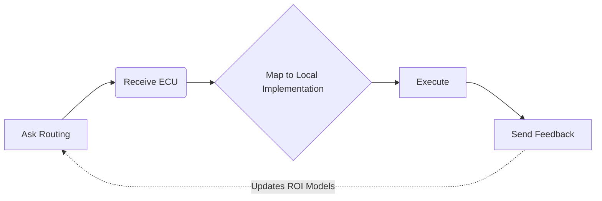

<div align="center">


# WisePick | 智选

> **Docs:** [Overview](./README.md) | [Integration & SDK](./README_API.md) | [Agent Protocol](./AGENTS.md)

**The deterministic layer that helps agent runtimes make better execution decisions.**

**帮助 Agent Runtime 做出更优执行决策的确定性层。**

[](https://github.com/w2jmoe/WisePick/stargazers)
[](./LICENSE)
[](https://twitter.com/w2jmoe)


</div>

---

## 🚀 WisePick Decision API (WPDA)

- Deterministic capability selection for AI agents.
- 为 AI Agent 提供确定性能力选择。

### What it is | 智选是什么

WisePick is a small decision layer for agent runtimes. It takes an intent, picks the best capability, and improves from execution feedback.

智选是一个面向 Agent Runtime 的轻量决策层：输入意图，选择最合适的能力，并从执行反馈中持续优化。

### Who is it for | 适用于谁

- Agent Operators
- Agent Runtime Builders
- Internal Agent Teams
- Agent SaaS Platforms
- Agent Hosting Providers

For teams running real agent workflows.

面向运行真实 Agent Workflow 的团队。

### Why it matters | 为什么重要

WisePick cuts tool searching, retry loops, latency, and cost by reusing execution feedback.

智选通过复用执行反馈，减少工具搜索、重试循环、延迟和成本。

---

## 📘 Contents | 目录

| Core Sections                                                               | 核心章节      |
| --------------------------------------------------------------------------- | --------- |
| [🚀 Getting Started](#-getting-started--开始接入)                               | 开始接入      |
| [⚡ Why Integrate WisePick](#-why-integrate-wisepick--为什么接入智选)               | 为什么接入智选   |
| [📜 Performance & Cost Benchmarks](#-performance--cost-benchmarks--性能与成本报告) | 性能与成本报告   |
| [🧠 How It Works](#-how-it-works--工作原理)                                     | 工作原理      |
| [🏗️ Architectural Paradigm](#%EF%B8%8F-architectural-paradigm--架构范式演进)     | 架构范式演进    |
| [🧪 Agent Workflow](#-agent-workflow--agent-工作流)                            | Agent 工作流 |
| [🔮 Vision](#-vision--愿景)                                                   | 愿景        |
| [🗺️ Roadmap](#%EF%B8%8F-roadmap--路线图)                                      | 路线图       |
| [🤗 Feedback](#-feedback--反馈)                                               | 反馈        |

---

## 🚀 Getting Started | 开始接入

### Option A — Hosted Shared Feedback Pool (Recommended) | 选项 A — 托管共享反馈池（推荐）

Use the public WisePick deployment.

使用公共 WisePick 服务。

**Endpoint**

```text
https://api.wishweaver.top
```

**Why choose Hosted?**

- Zero deployment
- Shared feedback accumulation
- Fastest onboarding
- Future-compatible with the Execution Experience Network vision

**为什么选择托管版？**

- 无需部署
- 共享反馈沉淀
- 接入速度最快
- 兼容未来 Execution Experience Network 演进方向

快速验证：

```bash
curl https://api.wishweaver.top/health
```

适用于：

- Agent Operators
- Runtime Builders
- Agent Infrastructure Teams

---

### Option B — Self-hosted | 选项 B — 自行部署

Deploy WisePick on your own infrastructure and keep routing data fully isolated.

在自己的基础设施上部署 WisePick，并完全独立管理路由数据。

**Why choose Self-hosted?**

- Full data ownership
- Private feedback memory
- Internal deployments
- Custom infrastructure control

**为什么选择自部署版？**

- 数据完全自有
- 独立反馈记忆
- 适合内部系统
- 完全控制基础设施

```bash
git clone https://github.com/w2jmoe/WisePick.git
cd WisePick

cp .env.example .env

pip install -r requirements.txt

uvicorn app.main:app --host 0.0.0.0 --port 8000
```

---

## 🤖 Have Your Agent Integrate WisePick | 让 Agent帮你的Runtime接入 WisePick

For agent-assisted runtime integration, paste this into your agent:

对于支持执行安装协议的 Agent，可直接输入：

```text
Retrieve and follow the instructions at:

https://raw.githubusercontent.com/w2jmoe/WisePick/main/INSTALL_FOR_AGENTS.md
```

Default endpoint:

```text
https://api.wishweaver.top
```

This configures WisePick as a decision and feedback layer for your runtime.

该流程会将 WisePick 配置为 Runtime 的决策与反馈层。

---

### Documentation | 开发文档

- [INSTALL_FOR_AGENTS.md](./INSTALL_FOR_AGENTS.md) → Deployment & Verification
- [README_API.md](./README_API.md) → SDK Integration
- [AGENTS.md](./AGENTS.md) → Protocol Specification

**Help us refine:** If you find the docs confusing, please [open an issue](https://github.com/w2jmoe/WisePick/issues) — we are aggressively refining our integration flow.
**反馈建议：** 若您在接入中遇到任何困惑，请 [提交 Issue](https://github.com/w2jmoe/WisePick/issues)，我们正在全力优化文档与接入体验。

---

## ⚡ Why Integrate WisePick | 为什么接入智选

- Lower cost and latency by cutting trial-and-error.
更低成本与延迟：减少无效试错与 Token 浪费。
- One best capability per decision.
每次决策只选一个最合适的能力。
- Feedback makes the next decision better.
执行反馈让下一次选择更好。

---

## 📜 Performance & Cost Benchmarks | 性能与成本报告

Production-oriented deterministic routing vs. native LLM tool-calling. Tested inside a Hermes-style agent runtime.
面向生产的确定性路由与原生 LLM 工具调用的对比测试。已在 Hermes 类 Agent 运行时中完成验证。

### Runtime Efficiency | 运行时效率提升


| Metrics               | Native LLM | WisePick         | Optimization                     |
| --------------------- | ---------- | ---------------- | -------------------------------- |
| **🚀 Path Speed**     | Baseline   | **~31% Faster**  | Shrunk from 6.33 to 4.33 steps   |
| **⏱️ Time Saved**     | Baseline   | **~62% Saved**   | Benchmark cut from 12m to 4m30s  |
| **💵 Cost Cut**       | High       | **~33% Reduced** | $0.15 → $0.10 per session        |
| **🎯 First-Hit Rate** | Exp.       | **100% Locked**  | Zero hallucinated tool-selection |


### Key Capabilities | 核心优势

- **Zero-Latency Gatekeeping**: Sub-millisecond average latency under isolated routing-core stress testing.
（隔离路由核心压测下平均亚毫秒级延迟）
- **Anti-Loop Depth**: Stabilizes execution across 20+ mixed-tool tasks without infinite loops.
（在 20+ 混合工具任务下稳定运行，彻底消除无限循环路径）

Benchmark scripts & instrumentation: [BENCHMARK](./benchmark/) | [STRESS_TEST_RESULTS.md](./docs/STRESS_TEST_RESULTS.md)

---

## 🧠 How It Works | 工作原理

### Capability Matching | 能力匹配

Task text → capability labels derived from bootstrap rules.
任务文本 → 由引导规则得到能力标签。

### Capability Scoring | 能力评分

```text
base_score =
  capability_match * 0.70
  + effective_success_rate * 0.20
  + effective_bootstrap_weight * 0.10

final_score = base_score * efficacy

efficacy = result_quality / (log(max(avg_latency_ms, 100)) * log(max(avg_token_cost, 10)))
```

Metrics (`success_rate`, `avg_latency_ms`, `avg_token_cost`, `avg_result_quality`) come from the `tool_stats` view. If `capability_match` is 0, `effective_success_rate` is penalized × 0.1. `effective_bootstrap_weight` decays as `feedback_count` grows.

### Feedback Loop | 反馈闭环

```text
decision → execution → feedback → tool_stats → next decision

Routing updates from real execution outcomes.
路由统计随真实执行结果更新。
```

### Components | 核心组件

```text
Routing Core (decision_engine)
Converts incoming tasks into ECU scores and selects the best capability.
将输入任务转换为 ECU（执行单元）评分并进行路由决策。

Capability Registry (api_tool_specs)
Maintains available providers, capability labels, and bootstrap weights.
管理可用 Provider、能力标签及冷启动权重分配。

Execution Memory (tool_stats, feedback)
Stores execution feedback reported by your runtime and continuously improves routing quality.
存储由运行时上报的执行反馈，并持续优化路由质量。
```

---

## 🏗️ Architectural Paradigm | 架构范式演进

WisePick unifies both hard-coded and dynamic tool discovery under a deterministic routing layer.

智选将硬编码与动态发现路线统一于确定性路由层。

| Paradigm    | Discovery      | Runtime Pain                                               | WisePick Value                                      |
| ----------- | -------------- | ---------------------------------------------------------- | --------------------------------------------------- |
| **Static**  | Manual config  | Brittle scaling, zero runtime flexibility                  | Centralized ECU registry, cleaner code              |
| **Dynamic** | Auto-discovery | **Tool Anxiety:** Context explosion, loops, hallucinations   | **Deterministic Filter:** Cuts 95% noise, 100% lock   |

### High-Level Architecture | 整体架构概览


* **Ingress:** Unified entry point for external runtimes and agents.
* **Intelligence:** Dynamic capability routing based on ROI and execution feedback.
* **Closure:** Execution feedback flows back into WisePick to continuously improve routing quality.

* **请求入口：** 外部 Runtime 与 Agent 的统一接入入口。
* **决策引擎：** 基于 ROI 与执行反馈的动态能力路由决策。
* **反馈闭环：** 执行反馈持续回流至 WisePick，驱动路由质量不断优化。

---

## 🧪 Agent Workflow | Agent 工作流



WisePick provides decision intelligence and feedback loops—not task execution.

智选提供决策智能与反馈闭环；**不替代**任务执行本身。

---

## 🔬 ECU Response (with ROI Metrics) | 带有 ROI 指标的 ECU 响应

> **ECU (Executable Capability Unit)**
> A standardized executable capability an agent can route, invoke, and learn from.
> 可执行能力单元：可被路由、调用并通过反馈学习的标准化能力抽象。

```json
{
  "metadata": {
    "schema_version": "mcp.route_decision.v1",
    "decision_id": "dec_abc123def4567890",
    "trace_id": "trace_9876543210abcdef",
    "router_name": "wisepick",
    "capability_id": "audio_transcription",
    "provider": "feishu_minutes",
    "execution_type": "api",
    "callable": true,
    "confidence": 0.87,
    "latency_ms": 450,
    "candidate_count": 1,
    "top_candidates": [
      {
        "rank": 1,
        "capability_id": "audio_transcription",
        "score": 0.87,
        "selected": true
      }
    ],
    "reason_codes": ["capability_match"]
  }
}

```

WisePick predicts performance before execution to ensure the best ROI.

WisePick 在执行前预测性能，以确保最佳投资回报率 (ROI)。

---

## 🔮 Vision | 愿景

**Long-term: Execution Experience Network — collective decision memory across agent runtimes.**

**长期愿景：执行经验网络（Execution Experience Network）— 跨运行时的集体决策记忆。**

**Today:** WisePick Decision API (WPDA) delivers deterministic capability routing and execution feedback via SDK integration; your runtime owns invoke, policy, and retries.

**当前：** WisePick Decision API（WPDA） 通过 SDK 提供确定性能力路由与执行反馈；工具调用、策略与重试由您的运行时负责。

WisePick turns execution outcomes into reusable routing experience — the foundation for shared ECU feedback and feedback-driven execution optimization on the path to that network.

智选将执行结果沉淀为可复用的路由经验，为 ECU 反馈共享与反馈驱动的执行优化奠定基础，并沿路线图演进至上述网络愿景。

---

## 🗺️ Roadmap | 路线图

- **✅ v0.1**: Core Infrastructure · 核心路由与反馈闭环
  - Deterministic ECU routing & feedback loop.
  - Multi-dimensional ROI metrics aggregation (Latency / Cost / Quality).
- **🔄 v0.2**: Runtime-Aware Optimization · Runtime 感知执行优化
  - Hosted Shared Feedback Pool MVP (v0.2.2).
  - Runtime registry alignment (`api_tool_specs` → `tool_stats`).
  - Feedback idempotency & decision persistence safety.
  - Task-level capability routing for multi-agent runtimes.
  - Adaptive execution-path optimization based on latency / cost / quality feedback.
  - Lightweight integration adapters for orchestration frameworks.
- **🔄 v0.3**: Collective Decision Memory · 集体决策记忆
  - Cross-agent experience sharing (Execution Experience Network direction).
  - Global capability indexing & optimization.

---

## 🌐 Ecosystem Alignment | 生态兼容

[](https://github.com/yantrikos/yantrikdb-server)
[](https://github.com/avivsinai/langfuse-mcp)
[](https://github.com/dgenio/ChainWeaver)
[](https://github.com/Colin4k1024/Aetheris)
[](https://github.com/azender1/SafeAgent)
[](https://github.com/gryszzz/open-thymos)

---

## 🤗 Feedback | 反馈

- **Issues:** [GitHub Issues](https://github.com/w2jmoe/WisePick/issues)
- **Email:** [w2jmoe@gmail.com](mailto:w2jmoe@gmail.com)

**Every routing decision feeds execution feedback today — and collective decision memory as the platform evolves toward the Execution Experience Network vision.**

**每一次路由决策都会形成执行反馈；随平台演进，亦将沉淀为集体决策记忆，迈向执行经验网络愿景。˗ˋˏ( ´͈ ᗜ `͈ )ˎˊ˗**

---

## 🌸 License | 许可协议

Apache License 2.0 — see [LICENSE](./LICENSE).


